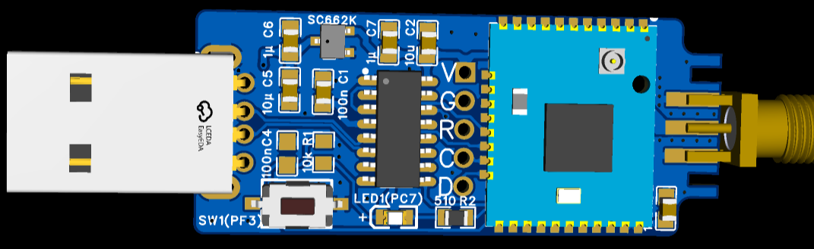

# zigbee firmware and releated

EmberZNet (EZSP) Zigbee 3.0 / Zigbee Coordinator (NCP) firmmware for Silicon Labs EFR32MG13 and EFR32MG21 DIY USB dongle.

## efr32mg13p732usb2zigbee

This folder is files for usb2zigbee( EFR32MG13) 

| Configuration Parameter  | Value |Flow Control|
|---------------|-----------|-----------|
| TX  | PA0 ||
| RX  | PA1 ||
| RTS | PF4 ||
| CTS | PA2 ||
| FlowControl| NO||
| Bootloader | bootloader-uart-xmodem.s37 ||
| Firmware(6.10) | ELE_MG13_zb_ncp_115200_610_211112.gbl |None|
| Firmware(7.3.2) | ncp-uart-hw-115200.7.3.2.gbl | Hardware|
| Firmware(7.3.2) | ncp-uart-noflowcontrol-115200.7.3.2.gbl | Hardware|